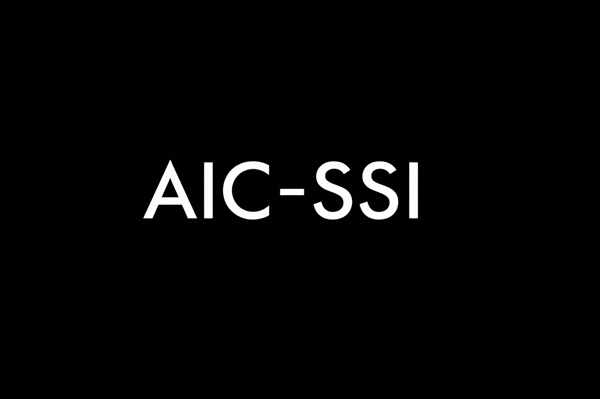

# AIC-SSI – Self-Sovereign Identity

**Official Self-Sovereign Identity Layer** of  
**Adaptive Intelligence Circle (AIC) & Human Meaning Network (HMN)**

  

### Vision
AIC-SSI is a fully decentralized, ethical-first identity system that gives every individual and node true sovereignty over their identity, data, and credentials — without relying on governments, corporations, or centralized authorities.

It is designed to operate natively with AIC’s **ethical-from-kernel** architecture and **third path absolute** principles.

### Core Principles
- **Self-sovereignty**: Identity belongs to the individual/node, not to any third party.
- **Ethical-by-design**: All identity operations are governed by the ethical kernel (IBCS).
- **Zero-donation & non-profit**: No financial incentives or external funding.
- **Privacy-first & quantum-safe**: Built for long-term resilience in a post-scarcity world.
- **GPLv3.0 licensed**: Full transparency and copyleft protection.

### Key Features (in development)
- Decentralized Identifiers (DID)
- Verifiable Credentials (VC)
- Ethical Wallet & key management
- Integration with AIC-DePin and AIC-EdgeOS
- Quantum-resistant cryptographic primitives
- Recovery & resilience mechanisms for HMN

### Current Status (April 2026)
This repository is in early architecture and prototype stage.  
It will serve as one of the foundational layers to protect user/node autonomy during and after the Founder’s mandatory military service.

**Part of the larger AIC ecosystem**:  
[Adaptive Intelligence Circle](https://github.com/AdaptiveIntelligenceCircle)

**License**: GPLv3.0 with Ethical Use Addendum (see `/POLICIES`)

**Maintained by**: Nguyễn Đức Trí (Founder & Architect)